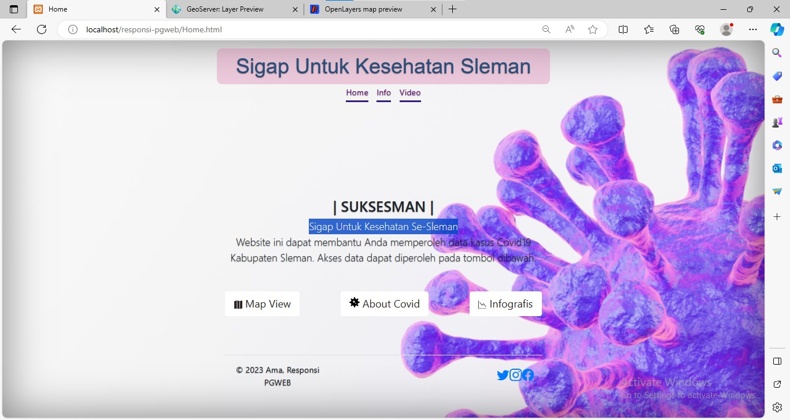
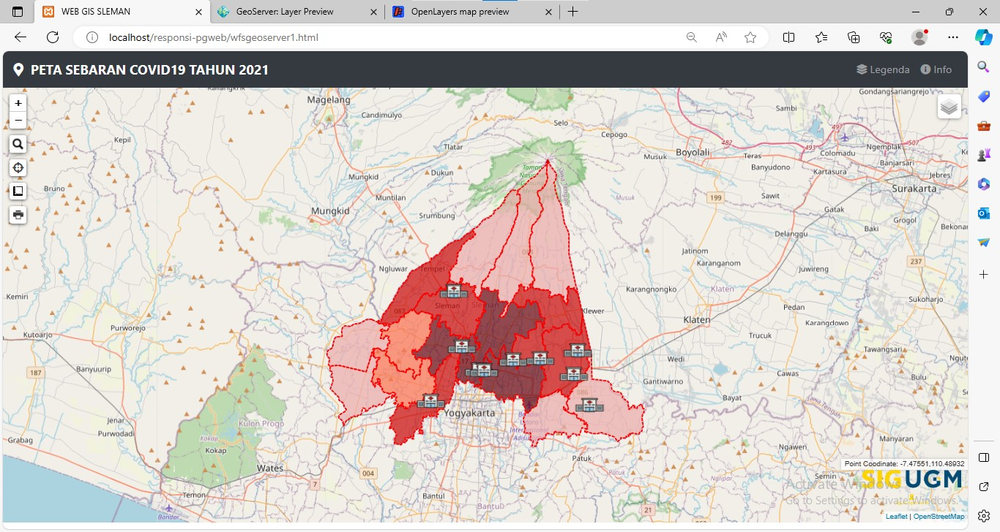
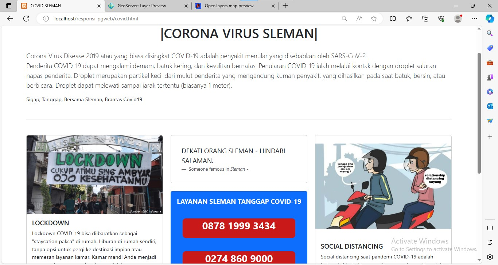
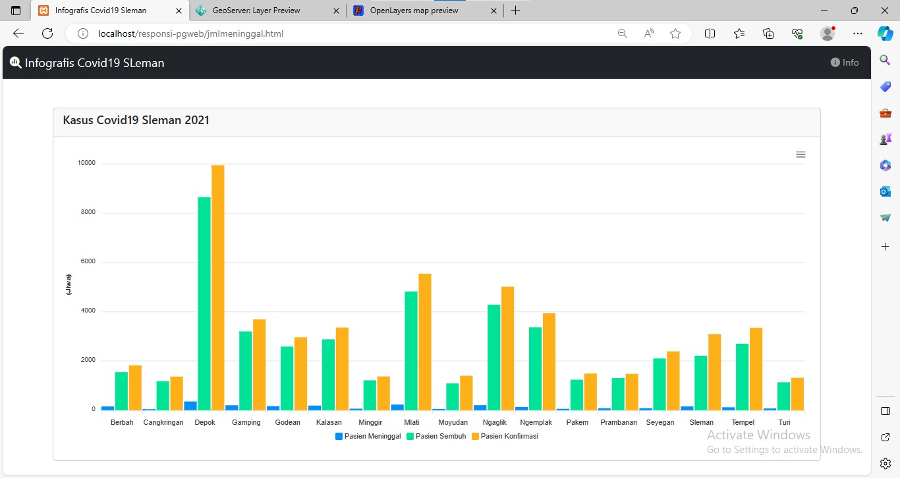
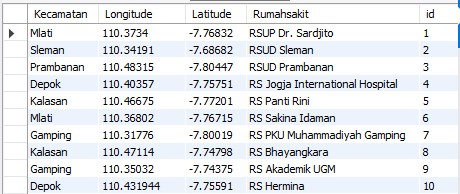
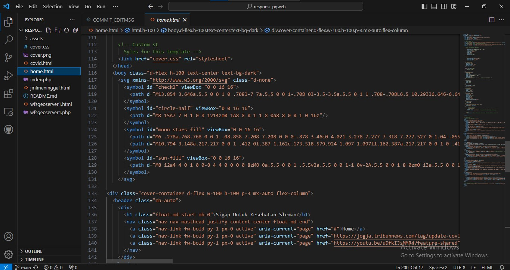
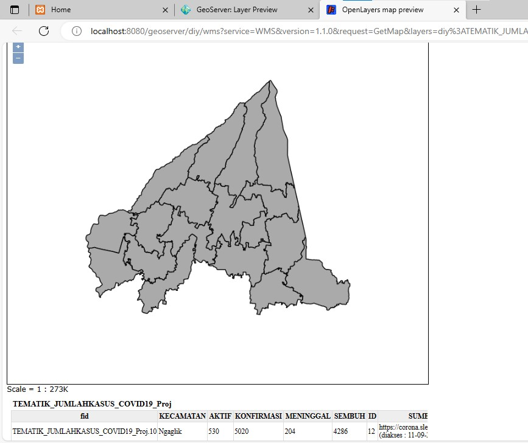

# responsi-pgweb
Nama Produk : SUKSESMAN (Sigap Untuk Kesehatan Se-Sleman)

Deskripsi produk : Suksesman merupakan website untuk menampilkan data-data terakit kesehatan terutama covid19 khususnya pada Kabupaten Sleman 

Komponen pembangun produk : 
- XAMPP, Geoserver --> sebagai pengkoneksi antara data dengan file yang akan di tampilkan
- Geoserver & MySQL --> wadah penyimpanan atau database dari data yang akan ditampilkan
- VS code --> penyusun kerangka coding
- Libarary (leaflet, bootsrap, font awesome)
- Gitbash/CMD --> alat untuk publikasi file ke github
- Data spasial, data tabular
Sumber data :
- Data spasial (Shapefile Kabupaten Sleman - Tematik kasus covid19 2021)
- Data BPS dalam angka 2021 Kabupaten Sleman (persebaran rumah sakit)
- Libabry (leaflet, bootsrap, font awesome)
- Foto pendukung 

Komponen :

Tampilan Home

Tampilan Map

Tampilan About

Tampilan Grafis

Tampilan About

Komponen penyusun 

